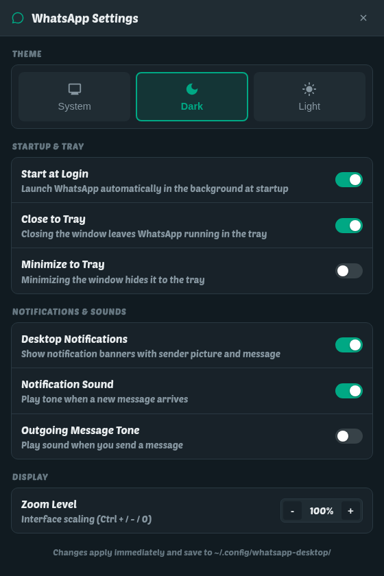

# whatsapp-desktop

WhatsApp for Linux: the web client in a desktop window of its own, on Chromium.
It loads `web.whatsapp.com`, so it is the same client WhatsApp serves to a
browser — no reverse-engineered protocol, and nothing that puts an account at
risk.

It is the second attempt. The first, [`whatsapp`](https://github.com/abdallah-shehawey/whatsapp),
is 120 KB of C against GTK4 and WebKitGTK; this one starts from an engine that
does not need most of its workarounds. They install side by side and share
nothing, not even a state directory.

**[abdallah-shehawey.github.io/whatsapp-desktop](https://abdallah-shehawey.github.io/whatsapp-desktop/)**
— every install command spelled out, and the newest packages read straight off
the latest release.

## What it does

- **Lives in the tray.** Closing the window keeps the client connected;
  `Ctrl+Q` and the tray's Quit are the two ways out, and it can start hidden at
  login. GNOME has no tray of its own: the icon needs the AppIndicator
  extension, and the client waits for it rather than giving up when it starts
  first at login.
- **Draws everything in the desktop's font**, applied live when you change it,
  and the conversation's own text size is a switch of its own: bigger or
  smaller messages with the chat list left where it was.
- **One notification per message**, with the sender, the text and the sender's
  picture, a click that opens that conversation, and a withdrawal the moment you
  open the chat or read it on your phone. Each message is its own entry rather
  than a replacement for the last, media says what kind it is (`📷 Photo`,
  `🏷 Sticker`, `🎤 Voice message`) so it cannot be mistaken for somebody typing
  the word, and Arabic reads right to left in the banner instead of wrapping
  the wrong way under a Latin name. Nothing is announced for a message you sent
  yourself, a muted group is silent unless you were mentioned in it, and
  do-not-disturb silences the tone as well as the banner.
- **Banners come down on the client's own clock.** GNOME shows one at a time,
  queues three behind it and drops the rest, so each banner is closed after
  twelve seconds and refiled silently in the notification centre.
- **Voice and video calls work out of the box.** Full WebRTC support for microphone and camera with automatic device permissions and Linux-specific rendering fixes.
- **Built-in Settings & Theme Switcher.** Switch between System Default, Dark Mode, and Light Mode, toggle Autostart at login, and configure tray behavior from the dedicated Settings window (`Ctrl+,`) or directly from the tray menu.
- **Screen sharing in a call**, over PipeWire on Wayland, offering windows as
  well as whole screens.
- Dark or light follows the desktop, links open in your browser, downloads land
  in `~/Downloads`, `Ctrl` `+`/`-`/`0` zoom and the window size is remembered.
  `Esc` closes the emoji panel whether or not you picked one.

<p align="center">
  
</p>

## Install

From the [shinux repository](https://abdallah-shehawey.github.io/shinux-repo/):

```sh
curl -fsSL https://abdallah-shehawey.github.io/shinux-repo/install.sh | sudo sh
sudo dnf install whatsapp-desktop     # Fedora and friends
sudo apt install whatsapp-desktop     # Debian, Ubuntu 24.04+
sudo pacman -S whatsapp-desktop       # Arch
```

Packages are also on every [release](../../releases), and the
[website](https://abdallah-shehawey.github.io/whatsapp-desktop/#download) links
whichever one is newest. It ships its own copy of Electron, so it needs no
browser installed — 245 MB on disk, 76 MB as a `.deb`.

The package installs a system-wide autostart entry, so the client starts hidden
in the tray at login. To stop that: Settings → Applications → Startup, or delete
`/etc/xdg/autostart/io.github.shehawey.whatsapp-desktop.desktop`.

## Build

Needs Node and nothing else.

```sh
make            # fetches Electron
make install    # ~/.local, plus a desktop entry and icons
make autostart  # also start hidden at login
make test       # replays a chat list past the watcher, no browser needed
```

## Keys

| | |
|---|---|
| `Ctrl` `+` / `-` / `0` | zoom in, out, reset |
| `Ctrl+Shift+I` | devtools |
| `Ctrl+Q` | quit for real |
| window close | hides to the tray, stays connected |

## Configuration

`~/.config/whatsapp-desktop/whatsapp-desktop.conf`, every key optional:

| Key | Default | What it does |
|---|---|---|
| `[view] font` | the GNOME interface font | family for everything the client draws |
| `[view] font-size` | `16` | root font size in pixels — WhatsApp sizes in rem |
| `[view] chat-font-size` | `100` | the conversation's text, as a percentage of WhatsApp's own |
| `[view] zoom` | `1.0` | also set with `Ctrl` `+`/`-` |
| `[view] force-font` | `true` | draw the page in one family |
| `[view] arabic-fix` | `false` | widen the boxes WhatsApp clips Arabic descenders against |
| `[window] width`, `height` | `1200x800` | remembered on exit |
| `[behaviour] close-to-tray` | `true` | closing the window leaves the client running |
| `[behaviour] minimize-to-tray` | `false` | minimise is not close |
| `[notifications] enabled` | `true` | off hands notifications back to Chromium |
| `[notifications] sound` | `true` | a tone for the banners this client raises |
| `[notifications] outgoing-sound` | `false` | WhatsApp's own tone for a message *you* send |
| `[notifications] whatsapp-sound` | `false` | let WhatsApp play its own tone for a message arriving, instead of the desktop tone this client plays either way |
| `[notifications] banner-seconds` | `12` | before a banner is refiled silently |

State lives in `~/.local/share/whatsapp-desktop`.

## Layout

| | |
|---|---|
| `src/main.js` | window, session, tray, notifications, switches |
| `src/preload.js` | the bridge — the page's world on one side, IPC on the other |
| `src/page/inject.js` | the chat-list watcher and the notification shim, in WhatsApp's own world |
| `src/notify.js` | the banner policy |
| `src/style.js` | the user stylesheet — the font, and the room Arabic needs |
| `src/fonts.js`, `src/tray.js`, `src/config.js`, `src/desktop.js`, `src/sound.js`, `src/debug.js` | |
| `tools/make-icons.py` | regenerates `data/icons` — `make icons`, never hand-edit the PNGs |
| `tools/make-og.py` | redraws the site's link-preview card — `make og` |
| `docs/` | the landing page, served by GitHub Pages from `main` |
| `tools/test-inject.js`, `tools/test-style.js` | `make test` |

## Notifications, when they do not appear

A notification carries the id of a `.desktop` file and GNOME reads its name and
icon from there, so running from a source tree with nothing installed gives a
banner titled `io.github.shehawey.whatsapp-desktop` with a blank icon.
`make install` is the fix, not a code change.

If a banner reaches the notification centre but never floats, check that a plain
`notify-send hello world` floats. If that does not either, it is the desktop —
GNOME suppresses banners while a window is fullscreen, while presence is BUSY,
and while `show-banners` is off.

## Diagnosing it

```sh
WHATSAPP_DEBUG_EVAL=/tmp/eval.js whatsapp-desktop
```

Whatever lands in that file is evaluated in the live page. Some words are
commands to the app instead: `#snapshot`, `#hide`, `#show`, `#state`, `#gpu`,
`#tone`, and `#scroll <selector>` — sixty real wheel events with the page's long
tasks sampled around them. Give `#scroll` the selector; left to pick a scroller
itself it can measure one element while the wheel turns over another.

Unset by default — it is a way into a live WhatsApp session, not a feature.

## Licence

GPL-3.0. Icon origins are recorded in `data/icons/NOTICE`.
